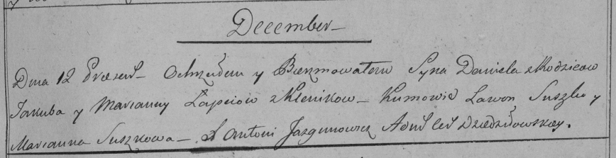
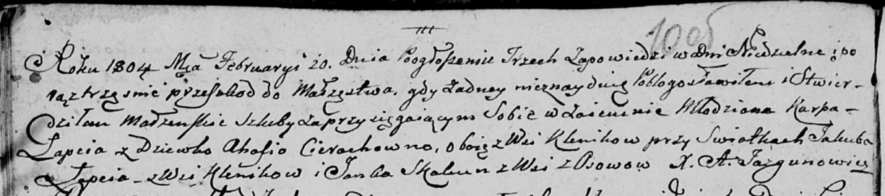

**Лапец Якуб (Łapać Jakub, Jakob)**

27 октября 1795 г -- венчание с Марьяной Моргун с деревни Клинники (НИАБ
136-13-920, лист 2, №5/1795-б (ориг)).

23 декабря 1795 г -- крещение сына Адама (НИАБ 136-13-894, лист 27,
№63/1795-р (ориг)), (РГИА 823-2-18, лист 254, №46/1795-р (коп)).

12 декабря 1798 г -- крещение сына Даниила (НИАБ 136-13-894, лист 37об,
№59/1798-р (ориг)), (РГИА 823-2-18, лист 267, №60/1798-р (коп)).

11 января 1802 г -- крещение дочери Катерыны (НИАБ 136-13-894, лист 46,
№9/1802-р (ориг)).

20 февраля 1804 г -- свидетель венчания молодого Карпа Лапеца с деревни
Клинники с девкой Агапой Церах с деревни Клинники (НИАБ 136-13-920, лист
10об, №4/1804-б (ориг)).

**НИАБ 136-13-920:** Лист 2. **Метрическая запись №5/1795-б (ориг).**

Дедиловичская Покровская церковь. 27 октября 1795 года. Метрическая
запись о венчании.

Łapać Jakub -- жених, деревня Клинники.

Marhunowna Marjana -- невеста, деревня Клинники.

Suszko Mikołaj -- свидетель.

Szyło Jhnat -- свидетель.

Jazgunowicz Antoni -- ксёндз.

**НИАБ 136-13-894:** Лист 27. **Метрическая запись №63/1795-р (ориг).**

Дедиловичская Покровская церковь. 23 декабря 1795 года. Метрическая
запись о крещении.

Łapać Adam -- сын родителей с деревни Клинники.

Łapać Jakub -- отец.

Łapciowa Marjana -- мать.

Suszko Leon - кум.

Suszkowa Ahapa - кума.

Jazgunowicz Antoni -- ксёндз.

**РГИА 823-2-18:** Лист 254. **Метрическая запись №46/1795-р (коп).**

Дедиловичская Покровская церковь. 23 декабря 1795 года. Метрическая
запись о крещении.

Łapiec Adam -- сын родителей с деревни Клинники.

Łapiec Jakub -- отец.

Łapciowa Marjanna -- мать.

Suszko Leon -- кум.

Suszkowa Ahapa -- кума.

Jazgunowicz Antoni -- ксёндз.

**НИАБ 136-13-894:** Лист 37об. **Метрическая запись №59/1798-р
(ориг).**

Дедиловичская Покровская церковь. 12 декабря 1798 года. Метрическая
запись о крещении.

Łapać Danijił -- сын родителей с деревни Клинники.

Łapać Jakob -- отец.

Łapciowa Marjana -- мать.

Suszko Lawon - кум.

Suszkowa Marjana - кума.

Jazgunowicz Antoni -- ксёндз.

**РГИА 823-2-18:** Лист 267. **Метрическая запись №60/1798-р (коп).**

Дедиловичская Покровская церковь. 12 декабря 1798 года. Метрическая
запись о крещении.

Łapiec Daniel -- сын родителей с деревни Клинники.

Łapiec Jakub -- отец.

Łapciowa Marianna -- мать.

Suszko Lawon -- кум.

Suszkowa Marianna -- кума.

Jazgunowicz Antoni -- ксёндз.

**НИАБ 136-13-894:** Лист 46. **Метрическая запись №9/1802-р (ориг).**

Дедиловичская Покровская церковь. 11 января 1802 года. Метрическая
запись о крещении.

Łapciowna Katerzyna -- дочь родителей с деревни Клинники.

Łapać Jakob -- отец.

Łapciowa Marjana -- мать.

Suszko Leon -- кум.

Suszkowna Agata -- кума.

Lewicki Bruno -- ксёндз.

**НИАБ 136-13-920:** Лист 10об. **Метрическая запись №4/1804-б (ориг).**

Дедиловичская Покровская церковь. 20 февраля 1804 года. Метрическая
запись о венчании.

Łapac Karp -- жених, молодой, с деревни Клинники.

Cierachowna Ahapa -- невеста, девка, с деревни Клинники.

Łapac Jakub -- свидетель, с деревни Клинники.

Skakun Janka -- свидетель, с деревни Осовo.

Jazgunowicz Antoni -- ксёндз.
