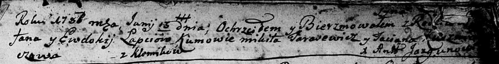
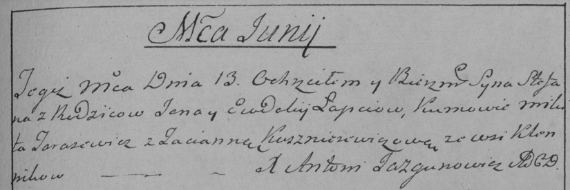

**Лапец Евдокия (Łapciowa Ewdokija)**

13 июня 1787 г -- крещение сына Стефана (НИАБ 136-13-894, лист 2,
№22/1787-р (ориг)), (РГИА 823-2-18, лист 234, №14/1787-р (коп))

**НИАБ 136-13-894:** Лист 2. **Метрическая запись №22/1787-р (ориг).**

Дедиловичская Покровская церковь. 13 июня 1787 года. Метрическая запись
о крещении.

Łapać -- сын родителей с деревни Клинники.

Łapać Jan -- отец.

Łapćiowa Ewdokija-- мать.

Tarasewicz Mikita - кум.

Kudziczowa? Taciana - кума.

Jazgunowicz Antoniusz -- ксёндз.

**РГИА 823-2-18:** Лист 234. **Метрическая запись №14/1787-р (коп).**

Дедиловичская Покровская церковь. 13 июня 1787 года. Метрическая запись
о крещении.

Łapiec Stefan -- сын родителей с деревни Клинники.

Łapiec Jan -- отец.

Łapciowa Eudokija -- мать.

Tarasewicz Mikita -- кум.

Kuszniarewiczowa Tacianna - кума.

Jazgunowicz Antoni -- ксёндз.
