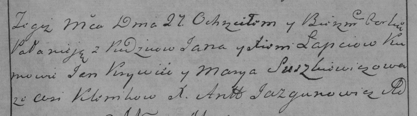

**Лапец Ксеня (Łapciowa Xienia)**

27 апреля 1785 г -- крещение дочери Паланеи (РГИА 823-2-18, лист 229,
№12/1785-р (ориг)).

**РГИА 823-2-18:** Лист 229. **Метрическая запись №12/1785-р (коп).**

{width="6.496527777777778in"
height="1.81875in"}

Дедиловичская Покровская церковь. 27 апреля 1785 года. Метрическая
запись о крещении.

Łapciowna Pałanieja -- дочь родителей с деревни Клинники.

Łapec Jan -- отец.

Łapciewa Xienia -- мать.

Krywiec Jan -- кум.

Suszkiewiczowa Marya - кума.

Jazgunowicz Antoni -- ксёндз.
