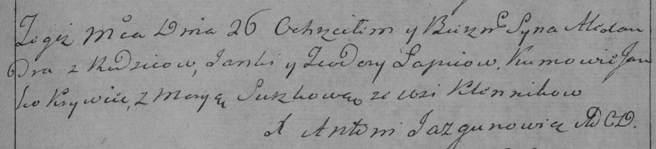

**Лапец Александр Янков (Łapać Alexander)**

26 августа 1792 г -- крещение (НИАБ 136-13-894, лист 16об, №51/1792-р
(ориг)), (РГИА 823-2-18, лист 245, №23/1792-р (коп)).

**НИАБ 136-13-894:** Лист 16об. **Метрическая запись №51/1792-р
(ориг).**

{width="6.496527777777778in"
height="0.8931135170603675in"}

Дедиловичская Покровская церковь. 26 августа 1792 года. Метрическая
запись о крещении.

Łapać Alexander -- незаконнорожденный сын родителей с деревни Клинники.

Łapać Janka -- отец.

Łapciowa Teodora -- мать.

Krywieć Janka - кум.

Suszkowa Marya - кума.

Jazgunowicz Antoni -- ксёндз.

**РГИА 823-2-18:** Лист 245. **Метрическая запись №23/1792-р (коп).**

{width="6.496527777777778in"
height="1.476388888888889in"}

Дедиловичская Покровская церковь. 26 августа 1792 года. Метрическая
запись о крещении.

Łapiec Alexander -- сын родителей с деревни Клинники.

Łapiec Janka -- отец.

Łapciowa Teodora -- мать.

Krywiec Janko -- кум.

Suszkowa Marya -- кума.

Jazgunowicz Antoni -- ксёндз.
