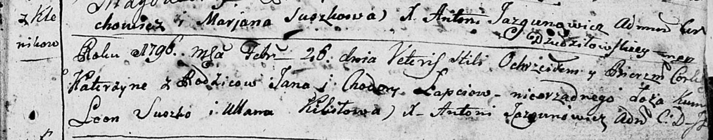

**Лапец Катерына Янкова (Łapciowna Katerzyna)**

26 февраля 1796 г -- крещение (НИАБ 136-13-894, лист 28, №24/1796-р
(ориг)).

Лист 28. **Метрическая запись №24/1796-р (ориг).**

{width="6.496527777777778in"
height="1.2833475503062117in"}

Дедиловичская Покровская церковь. 26 февраля 1796 года. Метрическая
запись о крещении.

Łapciowna Katerzyna -- незаконнорожденный сын родителей с деревни
Клинники.

Łapaс Jan -- отец.

Łapciowa Chodora -- мать.

Suszko Leon - кум.

Kikiłowa Ullana - кума.

Jazgunowicz Antoni -- ксёндз.
