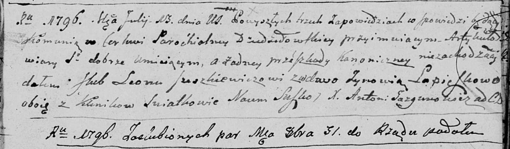

**Юшкевич (Лепёшко) Зыновия (Juszkiewiczowa (Lapioszkowa) Zynowia)**

13 июля 1796 г -- венчание со вдовой Зыновией Лепёшко с деревни Клинники
(НИАБ 136-13-920, лист 3, №9/1796-б (ориг)).

**НИАБ 136-13-920:** Лист 3. **Метрическая запись №9/1796-б (ориг).**

Дедиловичская Покровская церковь. 13 июля 1796 года. Метрическая запись
о венчании.

Juszkiewicz Leon -- жених, деревня Клинники.

Lapioszkowa Zynowia -- невеста, вдова, деревня Клинники.

Suszko Naum -- свидетель.

Jazgunowicz Antoni -- ксёндз.
