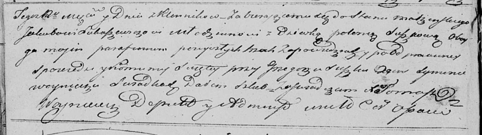

**Лукашевич (в девичестве Сушко) Полонея (Łukaszewiczowa Połonieja z
Suszkow)**

13 ноября 1821 г -- венчание с молодым Якубом Лукашевичем с деревни
Клинники (НИАБ 136-13-920, лист 28об, №10/1821-б (ориг)).

**НИАБ 136-13-920:** Лист 28об. **Метрическая запись №10/1821-б
(ориг).**

{width="6.496527777777778in"
height="1.8298097112860892in"}

Осовская Покровская церковь. 13 ноября 1821 года. Запись о венчании.

Łukaszewicz Jakub -- жених, молодой, парафии Осовской, с деревни
Клинники.

Suszkowa Połoneja -- невеста, девка, парафии Осовской.

Suszko Grzegorz -- свидетель.

Woynicz Symon -- свидетель.

Woyniewicz Tomasz -- ксёндз.
