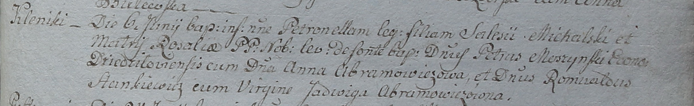

**Михальская Петронеля Салезова, шляхтянка (Michalska Petronella)**

6 июня 1798 г -- крещение (НИАБ 1781-27-199, лист 122, №6/1798-р).

**НИАБ 1781-27-199:** Лист 122. **Метрическая запись №6/1798-р.**

{width="6.496527777777778in"
height="1.0055555555555555in"}

Дедиловичский костел Наисвятейшего Сердца Иисуса. 6 июня 1798 года.
Метрическая запись о крещении.

Michalska Petronella -- дочь шляхтичей с деревни Клинники.

Michalski Salesi -- отец.

Michalska Rozalia -- мать.

Moszynski Petrus -- крестный отец, эконом Дедиловичский.

Abramowiczowa Anna - крестная мать.

Frankiewicz Romualdus -- ассистент.

Abramowiczowna Jadwiga -- ассистентка.

Linhart Hyacinthus -- ксёндз.
