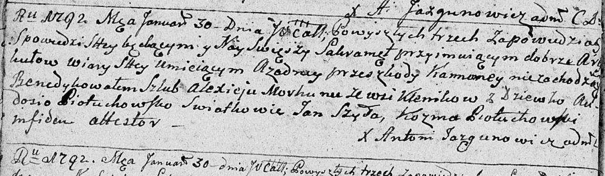

**Моргун (Пётуховская) Авдося (Morhunowa Audosia z Piotuchowskich)**

30 января 1792 г -- венчание с Алексеем Моргуном с деревни Клинники
(НИАБ 136-13-894, лист 70об, №3/1792-б (ориг))

**НИАБ 136-13-894:** Лист 70об. **Метрическая запись №3/1792-б (ориг).**

{width="6.496527777777778in"
height="1.890825678040245in"}

Дедиловичская Покровская церковь. 30 января 1792 года. Метрическая
запись о венчании.

Morhun Alexiey -- жених, с деревни Клинники.

Piotuchowska Audosia -- невеста.

Szyło Jan -- свидетель.

Piotuchowski Koźma -- свидетель.

Jazgunowicz Antoni -- ксёндз.
