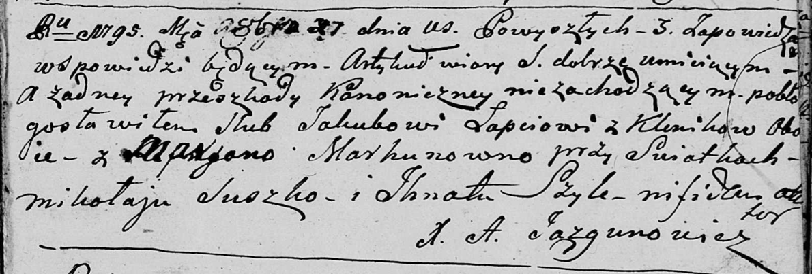

**Лапец (Моргун) Марьяна (Łapaciowa Marjana z Morhunow)**

27 октября 1795 г -- венчание с Якубом Лаптем с деревни Клинники (НИАБ
136-13-920, лист 2, №5/1795-б (ориг)).

**НИАБ 136-13-920:** Лист 2. **Метрическая запись №5/1795-б (ориг).**

{width="6.496527777777778in"
height="2.199928915135608in"}

Дедиловичская Покровская церковь. 27 октября 1795 года. Метрическая
запись о венчании.

Łapać Jakub -- жених, деревня Клинники.

Marhunowna Marjana -- невеста, деревня Клинники.

Suszko Mikołaj -- свидетель.

Szyło Jhnat -- свидетель.

Jazgunowicz Antoni -- ксёндз.
