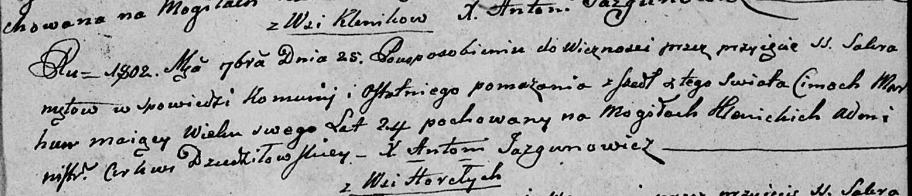

**Моргун Цимох (Marhun Cimoch)**

25 сентября 1802 г -- отпевание, умер в возрасте 24 года (родился около
1778 г) (НИАБ 136-13-919, лист 13, №10/1802-у (ориг)).

**НИАБ 136-13-919:** Лист 13. **Метрическая запись №10/1802-у (ориг).**

{width="6.496527777777778in"
height="1.3979166666666667in"}

Дедиловичская Покровская церковь. 25 сентября 1802 года. Метрическая
запись об отпевании.

Marhun Cimoch -- умерший, 24 года, с деревни Клинники, похоронен на
кладбище деревни Клинники.

Jazgunowicz Antoni -- ксёндз.
