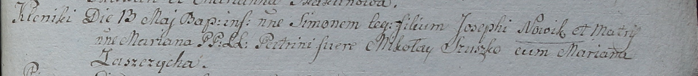

**Новик Симон Иосифов (Nowik Simon)**

13 мая 1798 г -- крещение (НИАБ 1781-27-199, лист 122, №3/1798-р).

**НИАБ 136-13-894:** Лист 122. **Метрическая запись №3/1798-р.**

{width="6.496527777777778in"
height="0.7104166666666667in"}

Дедиловичский костел Наисвятейшего Сердца Иисуса. 13 мая 1798 года.
Метрическая запись о крещении.

Nowik Simon -- сын крестьян с деревни Клинники.

Nowik Jozeph -- отец.

Nowik Mariana -- мать.

Szuszko Mikołay -- крестный отец.

Zaszczycha Mariana - крестная мать.

Linhart Hyacinthus -- ксёндз.
