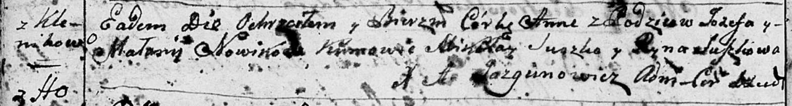

**Новик Маланья (Nowikowa Małanija)**

24 ноября 1795 г -- крещение дочери Анны (НИАБ 136-13-894, лист 26об,
№58/1795-р (ориг)).

**НИАБ 136-13-894:** Лист 26об. **Метрическая запись №58/1795-р
(ориг).**

{width="6.496527777777778in"
height="0.8797036307961504in"}

Дедиловичская Покровская церковь. 24 ноября 1795 года. Метрическая
запись о крещении.

Nowikowna Anna -- дочь родителей с деревни Клинники.

Nowik Jozef -- отец.

Nowikowa Małanija -- мать.

Suszko Mikołay - кум.

Suszkowa Ryna - кума.

Jazgunowicz Antoni -- ксёндз.
