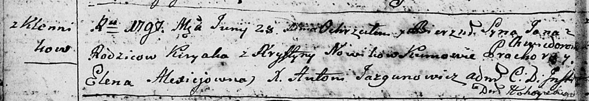
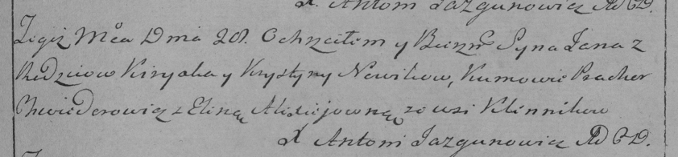

**Новик Ян Кирыаков (Nowik Jan)**

28 июня 1797 г -- крещение (НИАБ 136-13-894, лист 33об, №40/1797-р
(ориг)), (РГИА 823-2-18, лист 260, №27/1797-р (коп)).

**НИАБ 136-13-894:** Лист 33об. **Метрическая запись №40/1797-р
(ориг).**

Дедиловичская Покровская церковь. 28 июня 1797 года. Метрическая запись
о крещении.

Nowik Jan -- сын родителей с деревни Клинники.

Nowik Kiryak -- отец.

Nowikowa Krystyna -- мать.

Chwiedorowicz Prochor - кум.

Alexiejowna Elena - кума.

Jazgunowicz Antoni -- ксёндз.

**РГИА 823-2-18:** Лист 260. **Метрическая запись №27/1797-р (коп).**

Дедиловичская Покровская церковь. 28 июня 1797 года. Метрическая запись
о крещении.

Nowik Jan -- сын родителей с деревни Клинники.

Nowik Kiryak -- отец.

Nowikowa Krystyna -- мать.

Chwiedorowicz Prochor -- кум.

Alexiejowna Elena -- кума.

Jazgunowicz Antoni -- ксёндз.
