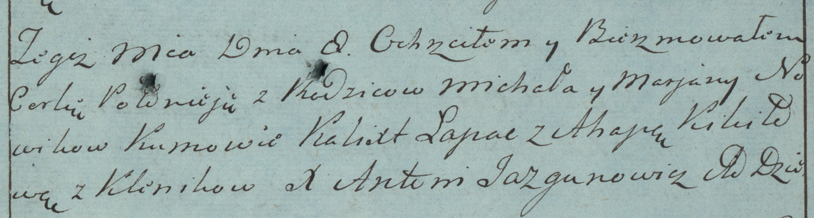

**Новик Полонея Михалова (Nowik Połonieja)**

8 октября 1783 г -- крещение (РГИА 823-2-18, лист 225, №25/1783-р
(коп)).

**РГИА 823-2-18:** Лист 225. **Метрическая запись №25/1783-р (коп).**

{width="6.496527777777778in"
height="1.7430555555555556in"}

Дедиловичская Покровская церковь. 8 октября 1783 года. Метрическая
запись о крещении.

Nowikowna Połonieja -- дочь родителей с деревни Клинники.

Nowik Michał -- отец.

Nowikowa Marjana -- мать.

Łapac Kalixt -- кум.

Kikiłowa Ahapa - кума.

Jazgunowicz Antoni -- ксёндз.
