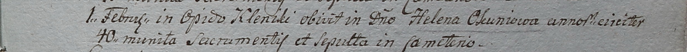

**Окунь Елена, шляхтянка (Okuniowa Helena)**

1 февраля 1799 г -- отпевание, умерла в возрасте 40 лет (родилась около
1759 г) (НИАБ 1781-27-199, лист 127, №7/1799-у)

**НИАБ 1781-27-199:** Лист 127. **Метрическая запись №7/1799-у.**

{width="6.496527777777778in"
height="0.5013888888888889in"}

Дедиловичский костел Наисвятейшего Сердца Иисуса. 1 февраля 1799 года.
Метрическая запись об отпевании.

Okuniowa Helena -- умершая, 40 лет, шляхтянка с деревни Клинники.

Linhart Hyacinthus -- ксёндз.
