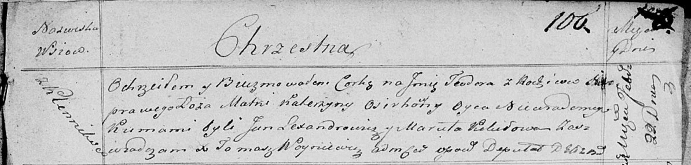

**Осир Катерына (Osirhowna Katerzyna)**

22 февраля 1821 г -- крещение незаконнорожденной дочери Тодоры (НИАБ
136-13-894, лист 106, №10/1821-р (ориг))

**НИАБ 136-13-894:** Лист 106. **Метрическая запись №10/1821-р (ориг).**

{width="6.496527777777778in"
height="1.5616076115485564in"}

Осовская Покровская церковь. 22 февраля 1821 года. Метрическая запись о
крещении.

Teodora -- незаконорожденная дочь с деревни Клинники.

Osirhowna Katerzyna -- мать.

Lexandrowicz Jan -- кум.

Kikiłowa Maruta -- кума.

Woyniewicz Tomasz -- ксёндз.
