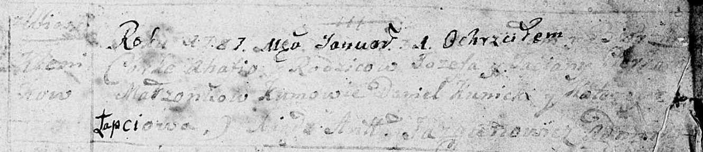
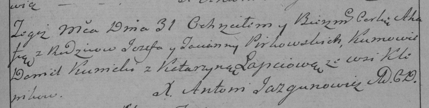

**Пирковский Иосиф (Pirkowski Jozef)**

31 января 1787 г -- крещение дочери Агафии (НИАБ 136-13-894, лист 1,
№1/1787-р (ориг)), (РГИА 823-2-18, лист 233, №2/1787-р (коп))

**НИАБ 136-13-894:** Лист 1. **Метрическая запись №1/1787-р (ориг).**

Дедиловичская Покровская церковь. 1 января 1787 года. Метрическая запись
о крещении.

? Ahafia -- дочь родителей с деревни Клинники.

? Jozef -- отец.

? Taciana -- мать.

Kunicki Daniel -- кум.

Łapciowa Katerzyna - кума.

Jazgunowicz Antoniusz -- ксёндз.

**РГИА 823-2-18:** Лист 233. **Метрическая запись №2/1787-р (коп).**

Дедиловичская Покровская церковь. 31 января 1787 года. Метрическая
запись о крещении.

Pirkowska Ahafija -- дочь родителей с деревни Клинники.

Pirkowski Jezef -- отец.

Pirkowska Tacianna -- мать.

Kunicki Daniel -- кум.

Łapciowa Katarzyna - кума.

Jazgunowicz Antoni -- ксёндз.
