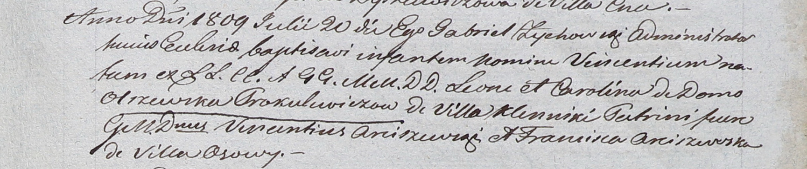

**Прокулевич Винцентий Леонов (Prokulewicz Vincenti)**

20 июля 1809 г -- крещение (НИАБ 937-4-32, лист 20, №23/1809-р).

**НИАБ 937-4-32:** Лист 20. **Метрическая запись №23/1809-р.**

Дедиловичский костел Наисвятейшего Сердца Иисуса. 20 июля 1809 года.
Метрическая запись о крещении.

Prokulewicz Vincenti -- сын шляхтичей с деревни Клинники.

Proculewicz Leon -- отец.

Prokulewiczowa Carolina z Olrzewskich -- мать.

Arciszewski Vincenti -- крестный отец, шляхтич.

Arciszewska Francisca -- крестная мать, шляхтянка, с деревни Осово.

Zychowski Gabriel -- ксёндз.
