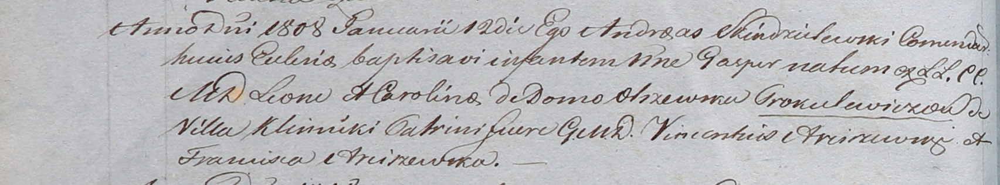

**Прокулевич Гаспер Леонов (Prokulewicz Gasper)**

12 января 1808 г -- крещение (НИАБ 937-4-32, лист 17об, №2/1808-р).

**НИАБ 937-4-32:** Лист 17об. **Метрическая запись №2/1808-р.**

Дедиловичский костел Наисвятейшего Сердца Иисуса. 12 января 1808 года.
Метрическая запись о крещении.

Proculewicz Gasper -- сын шляхтичей с деревни Клинники.

Proculewicz Leon -- отец.

Proculewiczowa Carolina z Olszewskich -- мать.

Arciszewski Vincentius -- крестный отец, шляхтич.

Arciszewska Franciszca -- крестная мать, шляхтянка.

Scindzelewski Andreas -- ксёндз, викарий Дедиловичский.
