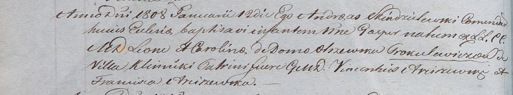

**Прокулевич (Ольшевская) Каролина (Prokulewiczowa Karolina z
Olszewskich)**

22 ноября 1803 г -- крещение дочери Эльжбеты (НИАБ 937-4-32, лист 9об,
№29/1803-р).

11 марта 1806 г -- крещение дочери Марьяны (НИАБ 937-4-32, лист 13,
№6/1806-р).

12 января 1808 г -- крещение сына Гаспера (НИАБ 937-4-32, лист 17об,
№2/1808-р).

20 июля 1809 г -- крещение сына Винцентия (НИАБ 937-4-32, лист 20,
№23/1809-р).

**НИАБ 937-4-32:** Лист 9об. **Метрическая запись №29/1803-р.**

{width="6.496527777777778in"
height="0.5319444444444444in"}

Дедиловичский костел Наисвятейшего Сердца Иисуса. 22 ноября 1803 года.
Метрическая запись о крещении.

Prokulewiczowna Elżbieta -- дочь родителей с деревни Клинники.

Prokulewicz Leon -- отец.

Prokulewiczowa Karolina -- мать.

Arciszewski Wincenty -- крестный отец.

Arciszewska Franciszka -- крестная мать.

Galinowski Joann -- ксёндз, комендант Дедиловичского костела.

**НИАБ 937-4-32:** Лист 13. **Метрическая запись №6/1806-р.**

{width="6.496527777777778in"
height="1.1430555555555555in"}

Дедиловичский костел Наисвятейшего Сердца Иисуса. 11 марта 1806 года.
Метрическая запись о крещении.

Prokulewiczowna Maryanna -- дочь родителей с деревни Клинники.

Prokulewicz Leon -- отец.

Prokulewiczowa Karolina -- мать.

Arciszewski Wincenty -- крестный отец.

Arciszewska Franciszka -- крестная мать.

Rzucki Rafal -- ксёндз, комендант Дедиловичский.

**НИАБ 937-4-32:** Лист 17об. **Метрическая запись №2/1808-р.**

{width="6.496527777777778in"
height="1.207638888888889in"}

Дедиловичский костел Наисвятейшего Сердца Иисуса. 12 января 1808 года.
Метрическая запись о крещении.

Proculewicz Gasper -- сын шляхтичей с деревни Клинники.

Proculewicz Leon -- отец.

Proculewiczowa Carolina z Olszewskich -- мать.

Arciszewski Vincentius -- крестный отец, шляхтич.

Arciszewska Franciszca -- крестная мать, шляхтянка.

Scindzelewski Andreas -- ксёндз, викарий Дедиловичский.

**НИАБ 937-4-32:** Лист 20. **Метрическая запись №23/1809-р.**

{width="6.496527777777778in"
height="1.367361111111111in"}

Дедиловичский костел Наисвятейшего Сердца Иисуса. 20 июля 1809 года.
Метрическая запись о крещении.

Prokulewicz Vincenti -- сын шляхтичей с деревни Клинники.

Proculewicz Leon -- отец.

Prokulewiczowa Carolina z Olrzewskich -- мать.

Arciszewski Vincenti -- крестный отец, шляхтич.

Arciszewska Francisca -- крестная мать, шляхтянка, с деревни Осово.

Zychowski Gabriel -- ксёндз.
