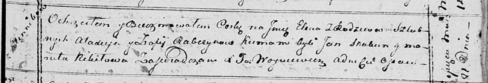

**Рабчык Аляксей (Rabczyk Alaxiey)**

15 февраля 1814 г -- крещение дочери Элеоноры (НИАБ 136-13-894, лист
88об, №10/1814-р (ориг)).

21 марта 1815 г -- крещение дочери Елены (НИАБ 136-13-894, лист 92,
№15/1815-р (ориг)).

**НИАБ 136-13-894:** Лист 88об. **Метрическая запись №10/1814-р
(ориг).**

{width="6.496527777777778in"
height="0.7878444881889763in"}

Осовская Покровская церковь. 15 февраля 1814 года. Метрическая запись о
крещении.

Rabczykowa Eleonora -- дочь родителей с деревни Клинники.

Rabczyk Alaxiey -- отец.

Rabczykowa Zofija -- мать.

Skakun Jan -- кум.

Łapciowa Marta -- кума.

Woyniewicz Tomasz -- ксёндз.

**НИАБ 136-13-894:** Лист 92. **Метрическая запись №15/1815-р (ориг).**

{width="6.496527777777778in"
height="1.116392169728784in"}

Осовская Покровская церковь. 21 марта 1815 года. Метрическая запись о
крещении.

Rabczykowna Elena -- дочь родителей с деревни Клинники.

Rabczyk Alaxiey -- отец.

Rabczykowa Zofija -- мать.

Skakun Jan -- кум.

Kikiłowa Maruta -- кума.

Woyniewicz Tomasz -- ксёндз.
