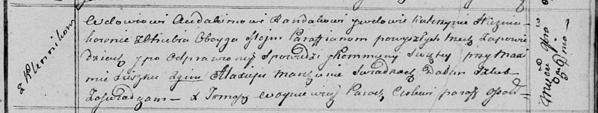

**Рандак (в предыдущем браке Гузняк) Катерына (Randakowa (Huzniakowna)
Katerzyna)**

5 ноября 1813 г -- венчание с вдовцом Авдакимом Рандаком с деревни
Клинники (НИАБ 136-13-920, лист 20, №18/1813-б (ориг)).

**НИАБ 136-13-920:** Лист 20. **Метрическая запись №18/1813-б (ориг).**

Осовская Покровская церковь. 5 ноября 1813 года. Запись о венчании.

Randak Audakim -- жених, вдовец, парафии Осовской, с деревни Клинники.

Huzniakowna Katerzyna -- невеста, вдова, парафии Осовской, с деревни
Отруб.

Suszko Maxim -- свидетель.

Marczun Alaxiey -- свидетель.

Woyniewicz Tomasz -- ксёндз.
