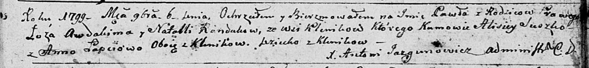
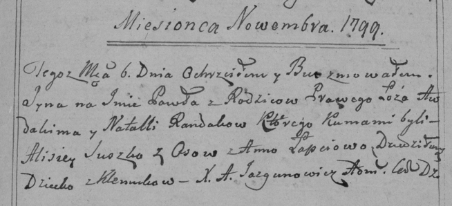

**Рандак Павел Авдакимов (Randak Paweł)**

9 ноября 1799 г -- крещение (НИАБ 136-13-894, лист 40, №45/1799-р
(ориг), РГИА 823-2-18, лист 273, №44/1799-р (коп), НИАБ 136-13-938, лист
245, №42/1799-р (коп)).

**НИАБ 136-13-894:** Лист 40. **Метрическая запись №45/1799-р (ориг).**

Дедиловичская Покровская церковь. 9 ноября 1799 года. Метрическая запись
о крещении.

Randak Paweł -- сын родителей с деревни Клинники.

Randak Awdakim -- отец.

Randakowa Natalla -- мать.

Suszko Alisiey -- кум, с деревни Клинники.

Łapciowa Anna -- кума, с деревни Клинники.

Jazgunowicz Antoni -- ксёндз.

**РГИА 823-2-18:** Лист 273. **Метрическая запись №44/1799-р (коп).**

Дедиловичская Покровская церковь. \[9\] ноября 1799 года. Метрическая
запись о крещении.

Randak Paweł -- сын родителей с деревни Клинники.

Randak Awdakim -- отец.

Randakowa Natalla -- мать.

Suszko Alisiey -- кум, с деревни Осово.

Łapciowa Anna -- кума, с деревни Дедиловичи.

Jazgunowicz Antoni -- ксёндз.

**НИАБ 136-13-938:** Лист 245. **Метрическая запись №42/1799-р (коп).**

(См. тж. НИАБ 136-13-894, лист 40, №45/1799-р (ориг); РГИА 823-2-18,
лист 273, №44/1799-р (коп))

Дедиловичская Покровская церковь. 6 ноября 1799 года. Метрическая запись
о крещении.

Łarywon \[Randak\] Paweł Symon -- сын родителей с деревни Клинники.

Łarywon \[Randak\] Awdakim -- отец.

Łarywonowa \[Randak\] Natalia -- мать.

Suszko Alisiey -- кум, с деревни Клинники.

Łapciowa Anna - кума, с деревни Клинники.

Jazgunowicz Antoni -- ксёндз.
