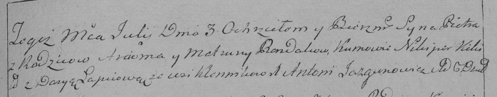

**Рандак Пётр Арцёмов (Randak Piotr)**

3 июля 1793 г -- крещение (НИАБ 136-13-894, лист 20, №54/1793-р (ориг)),
(РГИА 823-2-18, лист 248, №28/1793-р (коп)).

**НИАБ 136-13-894:** Лист 20. **Метрическая запись №54/1793-р (ориг).**

{width="6.496527777777778in"
height="0.7073829833770778in"}

Дедиловичская Покровская церковь. 3 июля 1793 года. Метрическая запись о
крещении.

Randak Piotr -- сын родителей с деревни Клинники.

Randak Arciom -- отец.

Randakowa Matruna -- мать.

Kikiło Nikipor - кум.

Łapciowa Darija - кума.

Jazgunowicz Antoni -- ксёндз.

**РГИА 823-2-18:** Лист 248. **Метрическая запись №28/1793-р (коп).**

{width="6.496527777777778in"
height="1.2694444444444444in"}

Дедиловичская Покровская церковь. 3 июля 1793 года. Метрическая запись о
крещении.

Randak Piotr -- сын родителей с деревни Клинники.

Randak Arciom -- отец.

Randakowa Matruna -- мать.

Kikiło Nikiper -- кум.

Łapciowa Darya -- кума.

Jazgunowicz Antoni -- ксёндз.
