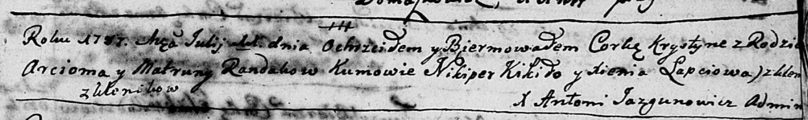
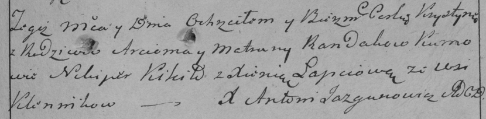

**Рандак Хрыстына Арцёмова (Randak Krystyna)**

11 июля 1787 г -- крещение дочери Хрыстыны (НИАБ 136-13-894, лист 2,
№28/1787-р (ориг)), (НИАБ 136-13-894, лист 2, №28/1787-р (ориг)).

**НИАБ 136-13-894:** Лист 2. **Метрическая запись №28/1787-р (ориг).**

Дедиловичская Покровская церковь. 11 июля 1787 года. Метрическая запись
о крещении.

Randakowna Krystyna - дочь родителей с деревни Клинники.

Randak Arciom -- отец.

Randakowa Matruna -- мать.

Kikiło Nikiper -- кум.

Łapćiowa Xienia - кума.

Jazgunowicz Antoniusz -- ксёндз.

**РГИА 823-2-18:** Лист 234. **Метрическая запись №19/1787-р (коп).**

Дедиловичская Покровская церковь. 11 июля 1787 года. Метрическая запись
о крещении.

Randakowna Krystyna -- дочь родителей с деревни Клинники.

Randak Arciom -- отец.

Randakowa Matruna -- мать.

Kikiło Nikiper -- кум.

Łapciowa Xienia - кума.

Jazgunowicz Antoni -- ксёндз.
