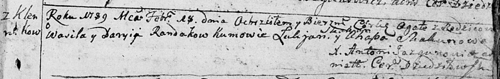
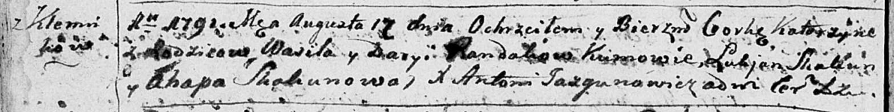
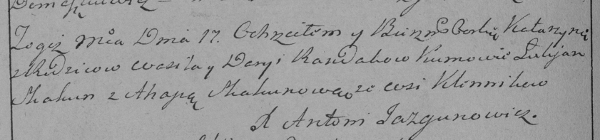
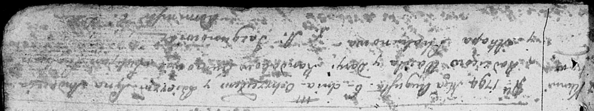
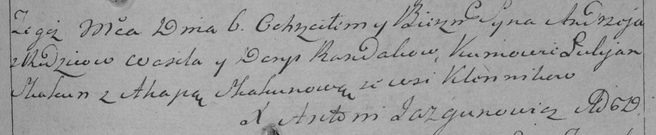
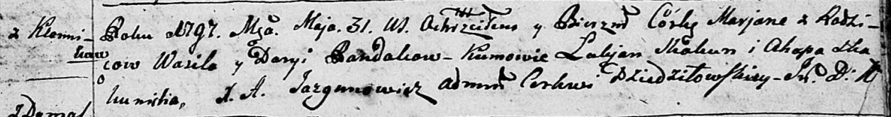
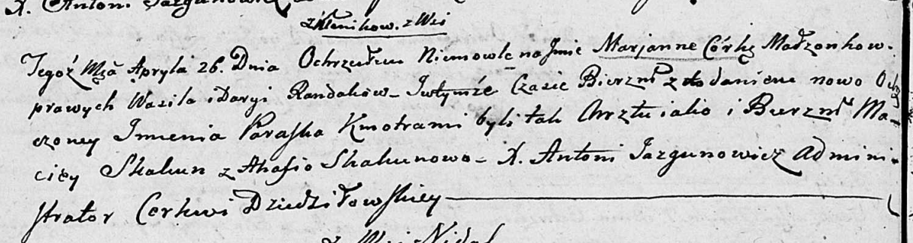
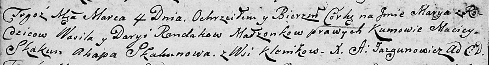

**Рандак Василь (Randak Wasil)**

13 февраля 1789 г -- крещение дочери Агаты (НИАБ 136-13-894, лист 6,
№9/1789-р (ориг)).

17 августа 1791 г -- крещение дочери Катерины (НИАБ 136-13-894, лист
13об, №39/1791-р (ориг)), (РГИА 823-2-18, лист 242, №19/1791-р (коп)).

6 августа 1794 г -- крещение сына Андрея (НИАБ 136-13-894, лист 22,
№31/1794-р (ориг)), (РГИА 823-2-18, лист 250, №21/1794-р (коп)).

31 мая 1797 г -- крещение дочери Марьяны (НИАБ 136-13-894, лист 32,
№33/1797-р (ориг)).

26 апреля 1803 г -- крещение дочери Марьяны Параски (НИАБ 136-13-894,
лист 50об, №18/1803-р (ориг)).

4 марта 1806 г -- крещение дочери Марыи (НИАБ 136-13-894, лист 59об,
№9/1806-р (ориг)).

**НИАБ 136-13-894:** Лист 6. **Метрическая запись №9/1789-р (ориг).**

Дедиловичская Покровская церковь. 13 февраля 1789 года. Метрическая
запись о крещении.

Randakowna Agata -- дочь родителей с деревни Клинники.

Randak Wasil-- отец.

Randakowa Daryia -- мать.

Skakun Łukjan - кум.

Skakunowa Ahapa - кума.

Jazgunowicz Antoniusz -- ксёндз.

**НИАБ 136-13-894:** Лист 13об. **Метрическая запись №39/1791-р
(ориг).**

Дедиловичская Покровская церковь. 17 августа 1791 года. Метрическая
запись о крещении.

Randakowna Katerzyna -- дочь родителей с деревни Клинники.

Randak Wasil -- отец.

Randak Darya -- мать.

Skakun Łukjan - кум.

Skakunowa Ahapa - кума.

Jazgunowicz Antoni -- ксёндз.

**РГИА 823-2-18:** Лист 242об. **Метрическая запись №19/1791-р (коп).**

Дедиловичская Покровская церковь. 17 августа 1791 года. Метрическая
запись о крещении.

Randakowna Katarzyna -- дочь родителей с деревни Клинники.

Randak Wasil -- отец.

Randakowa Darya -- мать.

Skakun Łukjan -- кум.

Skakunowa Ahapa - кума.

Jazgunowicz Antoni -- ксёндз.

**НИАБ 136-13-894:** Лист 22. **Метрическая запись №31/1794-р (ориг).**

Дедиловичская униатская церковь. 6 августа 1794 года. Метрическая запись
о крещении и миропомазании.

Randak Andrzey -- сын родителей с деревни Клинники.

Randak Wasil -- отец.

Randakowa Daryia -- мать.

Skakun Łukjan - кум.

Skakunowa Ahapa - кума.

Jazgunowicz Antoni -- ксёндз.

**РГИА 823-2-18:** Лист 250. **Метрическая запись №21/1794-р (коп).**

Дедиловичская Покровская церковь. 6 августа 1794 года. Метрическая
запись о крещении.

Randak Andrzey -- сын родителей с деревни Клинники.

Randak Wasil -- отец.

Randakowa Darya -- мать.

Skakun Łukjan -- кум.

Skakunowa Ahapa -- кума.

Jazgunowicz Antoni -- ксёндз.

**НИАБ 136-13-894:** Лист 33. **Метрическая запись №33/1797-р (ориг).**

Дедиловичская Покровская церковь. 31 мая 1797 года. Метрическая запись о
крещении.

Randakowna Marjana -- дочь родителей с деревни Клинники.

Randak Wasil -- отец.

Randakowa Daryia -- мать.

Skakun Łukjan - кум.

Skakunicha Ahapa - кума.

Jazgunowicz Antoni -- ксёндз.

**НИАБ 136-13-894:** Лист 50об. **Метрическая запись №18/1803-р
(ориг).**

Дедиловичская Покровская церковь. 26 апреля 1803 года. Метрическая
запись о крещении.

Randakowna Marjanna Paraska -- дочь родителей с деревни Клинники.

Randak Wasil -- отец.

Randakowa Daryia -- мать.

Skakun Maciey -- кум.

Skakunowa Ahafia -- кума.

Jazgunowicz Antoni -- ксёндз.

**НИАБ 136-13-894:** Лист 59об. **Метрическая запись №9/1806-р (ориг).**

Дедиловичская Покровская церковь. 4 марта 1806 года. Метрическая запись
о крещении.

Randakowna Marya -- дочь родителей с деревни Клинники.

Randak Wasil -- отец.

Randakowa Daryja -- мать.

Skakun Maciey -- кум.

Skakunowa Ahapa -- кума.

Jazgunowicz Antoni -- ксёндз.
