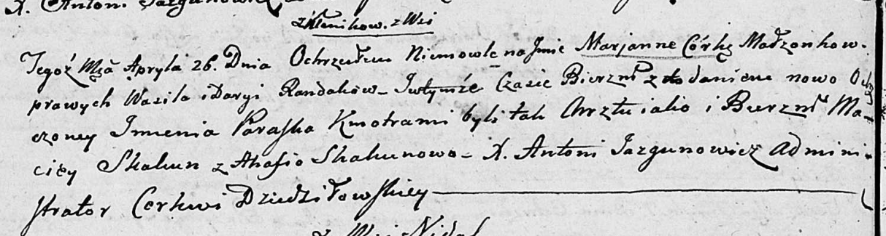

**Рандак Марьяна Василева младшая (Randakowna Marjanna Paraska)**

26 апреля 1803 г -- крещение (НИАБ 136-13-894, лист 50об, №18/1803-р
(ориг)).

**НИАБ 136-13-894:** Лист 50об. **Метрическая запись №18/1803-р
(ориг).**

Дедиловичская Покровская церковь. 26 апреля 1803 года. Метрическая
запись о крещении.

Randakowna Marjanna Paraska -- дочь родителей с деревни Клинники.

Randak Wasil -- отец.

Randakowa Daryia -- мать.

Skakun Maciey -- кум.

Skakunowa Ahafia -- кума.

Jazgunowicz Antoni -- ксёндз.
