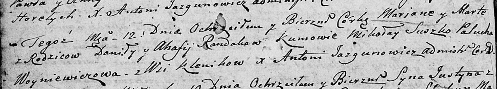

**Рандак Агафия (Randakowa Ahafija)**

12 ноября 1805 г -- крещение дочери Марьяны Марты (НИАБ 136-13-894, лист
58, №55/1805-р (ориг)).

**НИАБ 136-13-894:** Лист 58. **Метрическая запись №55/1805-р (ориг).**

{width="6.496527777777778in"
height="1.1686909448818898in"}

Дедиловичская Покровская церковь. 12 ноября 1805 года. Метрическая
запись о крещении.

Randakowna Marjana Marta -- дочь родителей с деревни Клинники.

Randak Daniła -- отец.

Randakowa Ahafija -- мать.

Suszko Mikołay -- кум.

Woyniewiczowa Palucha -- кума.

Jazgunowicz Antoni -- ксёндз.
