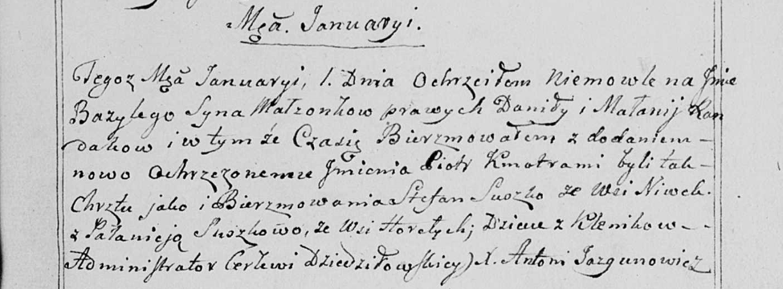

**Рандак Базыль Данилов (Randak Bazyli Piotr)**

1 января 1799 г -- крещение сына Базыля Петра (НИАБ 136-13-894, лист 38,
№1/1799-р (ориг)), (РГИА 823-2-18, лист 268, №1/1799-р (коп)), (НИАБ
136-13-938, лист 240, №1/1799-р (коп)).

**НИАБ 136-13-894:** Лист 38. **Метрическая запись №1/1799-р (ориг).**

{width="6.496527777777778in"
height="1.315531496062992in"}

Дедиловичская Покровская церковь. 1 января 1799 года. Метрическая запись
о крещении.

Randak Bazyli Piotr -- сын родителей с деревни Клинники.

Randak Daniła -- отец.

Randakowa Małanija -- мать.

Suszko Stefan - кум.

Suszkowa Pałanieja -- кума с деревни Горелое.

Jazgunowicz Antoni -- ксёндз.

**РГИА 823-2-18:** Лист 268. **Метрическая запись №1/1799-р (коп).**

{width="6.496527777777778in"
height="2.047222222222222in"}

Дедиловичская Покровская церковь. 1 января 1799 года. Метрическая запись
о крещении.

Randak Bazyli -- сын родителей с деревни Клинники.

Randak Daniło -- отец.

Randakowa Małannia -- мать.

Suszko Stefan -- кум, с деревни Клинники.

Suszkowa Połonieja -- кума, с деревни Клинники \[Горелое\].

Jazgunowicz Antoni -- ксёндз.

**НИАБ 136-13-938:** Лист 240. **Метрическая запись №1/1799-р (коп).**

(См. тж. НИАБ 136-13-894, лист 38, №1/1799-р (ориг); РГИА 823-2-18, лист
268, №1/1799-р (коп))

{width="6.496527777777778in"
height="2.3986111111111112in"}

Дедиловичская Покровская церковь. 1 января 1799 года. Метрическая запись
о крещении.

Randak Bazyli Piotr -- сын родителей с деревни Клинники.

Randak Daniła -- отец.

Randakowa Małanija -- мать.

Suszko Stefan -- кум, с деревни Нивки.

Suszkowa Pałanieja - кума, с деревни Горелое.

Jazgunowicz Antoni -- ксёндз.
