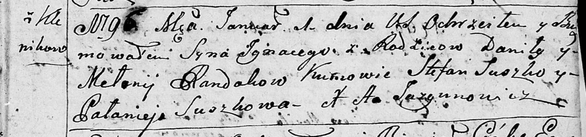
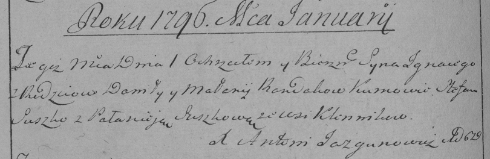

**Рандак Данила (Randak Daniła)**

28 октября 1789 г -- венчание с Маланьей Лапец (НИАБ 136-13-894, лист
67об, №7/1789-б (ориг)).

19 декабря 1792 г -- крещение дочери Юстыны (НИАБ 136-13-894, лист 18,
№85/1792-р (ориг)).

1 января 1796 г -- крещение сына Игнация (НИАБ 136-13-894, лист 27,
№1/1796-р (ориг)), (РГИА 823-2-18, лист 254об, №49/1795-р (коп)).

1 января 1799 г -- крещение сына Базыля Петра (НИАБ 136-13-894, лист 38,
№1/1799-р (ориг)), (РГИА 823-2-18, лист 268, №1/1799-р (коп)), (НИАБ
136-13-938, лист 240, №1/1799-р (коп)).

23 сентября 1800 г -- крещение дочери Марты Елисаветы (НИАБ 136-13-894,
лист 42, №27/1800-р (ориг)).

17 апреля 1804 г -- крещение сына Сымона Яна (НИАБ 136-13-894, лист
53об, №11/1804-р (ориг)).

**НИАБ 136-13-894:** Лист 67об. **Метрическая запись №7/1789-б (ориг).**

Дедиловичская Покровская церковь. 28 октября 1789 года. Метрическая
запись о венчании.

Randak Daniła -- жених, с деревни Клинники.

Łapciowna Malania -- невеста, с деревни Клинники.

Krywioć Wasil -- свидетель.

Łapać Jozef -- свидетель.

Jazgunowicz Antoni -- ксёндз.

**НИАБ 136-13-894:** Лист 18. **Метрическая запись №85/1792-р (ориг).**

Дедиловичская Покровская церковь. 19 декабря 1792 года. Метрическая
запись о крещении.

Randakowna Justyna -- дочь родителей с деревни Клинники.

Randak Daniła -- отец.

Randakowa Małanija -- мать.

Suszko Stefan - кум.

Suszkowa Pałanija - кума.

Jazgunowicz Antoni -- ксёндз.

**НИАБ 136-13-894:** Лист 27. **Метрическая запись №1/1796-р (ориг).**

Дедиловичская Покровская церковь. 1 января 1796 года. Метрическая запись
о крещении.

Randak Jhnacy -- сын родителей с деревни Клинники.

Randak Daniła -- отец.

Randakowa Mełanija -- мать.

Suszko Stefan - кум.

Suszkowa Pałanieja - кума.

Jazgunowicz Antoni -- ксёндз.

**РГИА 823-2-18:** Лист 254об. **Метрическая запись №1/1796-р (коп).**

Дедиловичская Покровская церковь. 1 января 1796 года. Метрическая запись
о крещении.

Randak Jgnacy -- сын родителей с деревни Клинники.

Randak Daniło -- отец.

Randakowa Małanija -- мать.

Suszko Stefan -- кум.

Suszkowa Pałanieja -- кума.

Jazgunowicz Antoni -- ксёндз.

**НИАБ 136-13-894:** Лист 38. **Метрическая запись №1/1799-р (ориг).**

Дедиловичская Покровская церковь. 1 января 1799 года. Метрическая запись
о крещении.

Randak Bazyli Piotr -- сын родителей с деревни Клинники.

Randak Daniła -- отец.

Randakowa Małanija -- мать.

Suszko Stefan - кум.

Suszkowa Pałanieja -- кума с деревни Горелое.

Jazgunowicz Antoni -- ксёндз.

**РГИА 823-2-18:** Лист 268. **Метрическая запись №1/1799-р (коп).**

Дедиловичская Покровская церковь. 1 января 1799 года. Метрическая запись
о крещении.

Randak Bazyli -- сын родителей с деревни Клинники.

Randak Daniło -- отец.

Randakowa Małannia -- мать.

Suszko Stefan -- кум, с деревни Клинники.

Suszkowa Połonieja -- кума, с деревни Клинники \[Горелое\].

Jazgunowicz Antoni -- ксёндз.

**НИАБ 136-13-938:** Лист 240. **Метрическая запись №1/1799-р (коп).**

(См. тж. НИАБ 136-13-894, лист 38, №1/1799-р (ориг); РГИА 823-2-18, лист
268, №1/1799-р (коп))

Дедиловичская Покровская церковь. 1 января 1799 года. Метрическая запись
о крещении.

Randak Bazyli Piotr -- сын родителей с деревни Клинники.

Randak Daniła -- отец.

Randakowa Małanija -- мать.

Suszko Stefan -- кум, с деревни Нивки.

Suszkowa Pałanieja - кума, с деревни Горелое.

Jazgunowicz Antoni -- ксёндз.

**НИАБ 136-13-894:** Лист 42. **Метрическая запись №27/1800-р (ориг).**

Дедиловичская Покровская церковь. 23 сентября 1800 года. Метрическая
запись о крещении.

Randakowna Marta Elżbieta -- дочь.

Randak Daniła -- отец.

Randakowa Mełanija -- мать.

Suszko Mikołay -- кум.

Suszkowa Palucha -- кума.

Jazgunowicz Antoni -- ксёндз.

**НИАБ 136-13-894:** Лист 53об. **Метрическая запись №11/1804-р
(ориг).**

Дедиловичская Покровская церковь. 17 апреля 1804 года. Метрическая
запись о крещении.

Randak Symeon Jan -- дочь родителей с деревни Клинники.

Randak Daniła -- отец.

Randakowa Melanija -- мать.

Suszko Mikołay -- кум, с деревни Горелое.

Szuszkowa Pałanieja -- кума, с деревни Осовo.

Jazgunowicz Antoni -- ксёндз.
