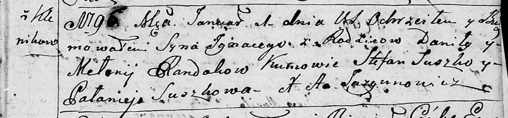
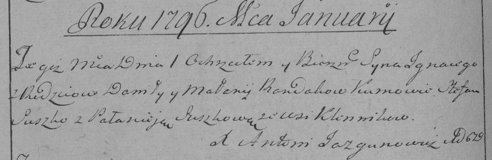

**Рандак Игнацы Данилов (Randak Jgnacy)**

1 января 1796 г -- крещение (НИАБ 136-13-894, лист 27, №1/1796-р
(ориг)), (РГИА 823-2-18, лист 254об, №49/1795-р (коп)).

**НИАБ 136-13-894:** Лист 27. **Метрическая запись №1/1796-р (ориг).**

Дедиловичская Покровская церковь. 1 января 1796 года. Метрическая запись
о крещении.

Randak Jhnacy -- сын родителей с деревни Клинники.

Randak Daniła -- отец.

Randakowa Mełanija -- мать.

Suszko Stefan - кум.

Suszkowa Pałanieja - кума.

Jazgunowicz Antoni -- ксёндз.

**РГИА 823-2-18:** Лист 254об. **Метрическая запись №1/1796-р (коп).**

Дедиловичская Покровская церковь. 1 января 1796 года. Метрическая запись
о крещении.

Randak Jgnacy -- сын родителей с деревни Клинники.

Randak Daniło -- отец.

Randakowa Małanija -- мать.

Suszko Stefan -- кум.

Suszkowa Pałanieja -- кума.

Jazgunowicz Antoni -- ксёндз.
