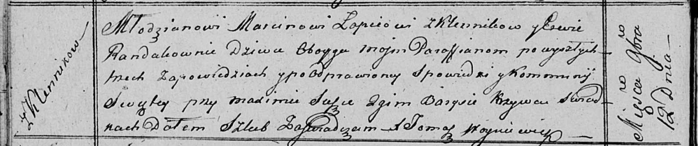

**Лапец (в девичестве Рандак) Ева (Łapciowa Ewa z Randakow)**

12 ноября 1816 г -- венчание с молодым Марцином Лапецом с деревни
Клинники (НИАБ 136-13-920, лист 23об, №13/1816-б (ориг)).

**НИАБ 136-13-920:** Лист 23об. **Метрическая запись №13/1816-б
(ориг).**

Осовская Покровская церковь. 12 ноября 1816 года. Запись о венчании.

Łapać Marcin -- жених, молодой, парафии Осовской, с деревни Клинники.

Randakowna Ewa -- невеста, девка, парафии Осовской, с деревни Клинники.

Suszko Maxim -- свидетель.

Krzywec Barys -- свидетель.

Woyniewicz Tomasz -- ксёндз.
