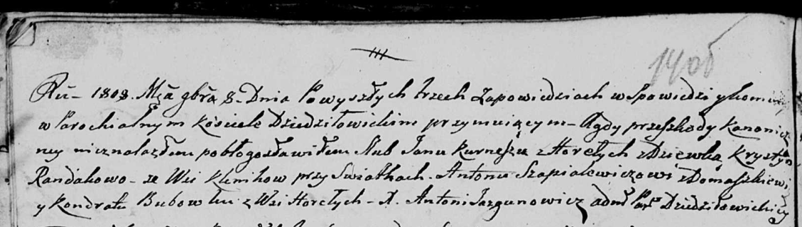

**Курнеш (в девичестве Рандак) Крыстына (Kurneszowa Krystyna z
Randakow)**

8 ноября 1808 г -- венчание с Яном Курнешом с деревни Горелое (НИАБ
136-13-920, лист 14об, №11/1808-б (ориг)).

**НИАБ 136-13-920:** Лист 14об. **Метрическая запись №11/1808-б
(ориг).**

Дедиловичская Покровская церковь. 8 ноября 1808 года. Метрическая запись
о венчании.

Kurnesz Jan -- жених, с деревни Горелое.

Randakowa Krystyna -- невеста, девка, с деревни Клинники.

Szapialewicz Anton -- свидетель, с деревни Домашковичи.

Babowka Kondrat -- свидетель, с деревни Горелое.

Jazgunowicz Antoni -- ксёндз.
