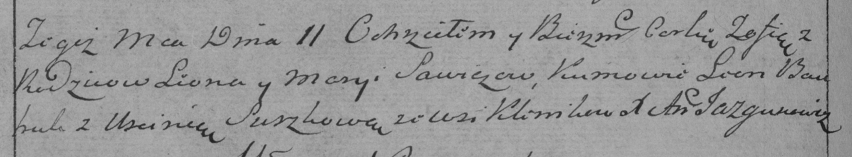

**Савич Зофия Леонова (Sawiczowna Zofia)**

11 октября 1786 г -- крещение (РГИА 823-2-18, лист 232об, №25/1786-р
(коп)).

**РГИА 823-2-18:** Лист 232об. **Метрическая запись №25/1786-р (коп).**

Дедиловичская Покровская церковь. 11 октября 1786 года. Метрическая
запись о крещении.

Sawiczowna Zofia -- дочь родителей с деревни Клинники.

Sawicz Leon -- отец.

Sawiczowa Marya -- мать.

Bautruk Leon -- кум.

Suszkowa Uscinia - кума.

Jazgunowicz Antoni -- ксёндз.
