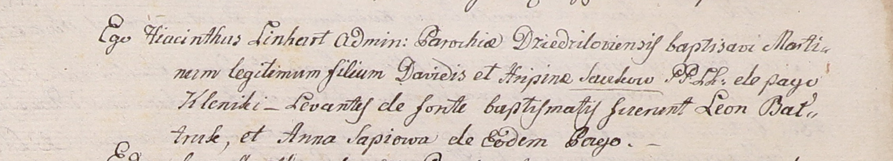

**Савко Мартин Давидов (Sauko Martin)**

Январь 1801 г -- крещение (НИАБ 937-4-32, лист 4, №1/1801-р).

**НИАБ 937-4-32:** Лист 4. **Метрическая запись №1/1801-р.**

Дедиловичский костел Наисвятейшего Сердца Иисуса. 1? января 1801 года.
Метрическая запись о крещении.

Sauko Martin -- сын крестьян с деревни Клинники.

Sauko Dawid -- отец.

Saukowa Hripina -- мать.

Batruk Leon -- крестный отец, с деревни Клинники.

Sapiowa Anna -- крестная мать, с деревни Клинники.

Linhart Hyacinthus -- ксёндз.
