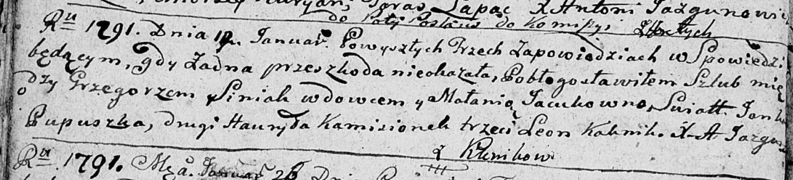
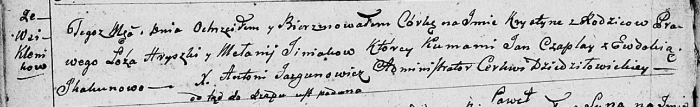
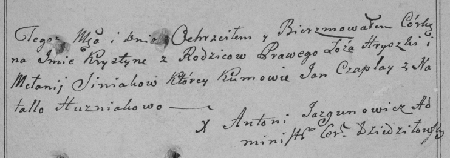
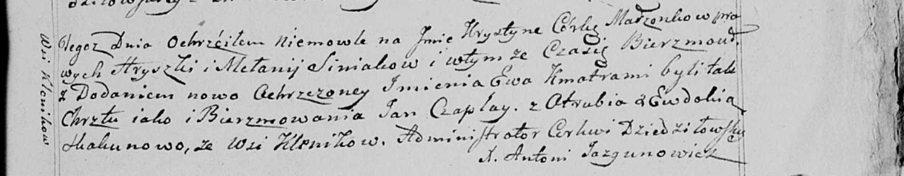

**Синяк Грышка (Siniak Hryszka, Grzegorz)**

12 января 1791 г -- венчание с Маланьей Яцук (НИАБ 136-13-894, лист
69об, №5/1791-б (ориг)).

20 августа 1799 г -- крещение дочери Крыстыны (НИАБ 136-13-894, лист
39об, №34/1799-р (ориг), РГИА 823-2-18, лист 271, №33/1799-р (коп), НИАБ
136-13-938, лист 243, №32/1799-р (коп)).

Лист 69об. **Метрическая запись №5/1791-б (ориг).**

Дедиловичская Покровская церковь. 12 января 1791 года. Метрическая
запись о венчании.

Siniak Grzegorz -- жених, вдовец, с деревни Клинники.

Jacukowna Małania -- невеста.

Pupuszka Janka -- свидетель.

Kamisionek Hauryła -- свидетель.

Kalenik? Leon -- свидетель.

Jazgunowicz Antoni -- ксёндз.

**НИАБ 136-13-894:** Лист 39об. **Метрическая запись №34/1799-р
(ориг).**

Дедиловичская Покровская церковь. 20 августа 1799 года. Метрическая
запись о крещении.

Siniakowna Krystyna -- дочь родителей с деревни Клинники.

Siniak Hryszka -- отец.

Siniakowa Mełanija -- мать.

Czaplay Jan -- кум.

Skakunowa Ewdokija -- кума.

Jazgunowicz Antoni -- ксёндз.

**РГИА 823-2-18:** Лист 271. **Метрическая запись №33/1799-р (коп).**

Дедиловичская Покровская церковь. 20 августа 1799 года. Метрическая
запись о крещении.

Siniakowna Krystyna -- дочь.

Siniak Hryszka -- отец.

Siniakowa Mełania -- мать.

Czaplay Jan -- кум.

Huzniakowa Natalla \[Skakunowa Ewdokija\] -- кума.

Jazgunowicz Antoni -- ксёндз.

**НИАБ 136-13-938:** Лист 243. **Метрическая запись №32/1799-р (коп).**

(См. тж. НИАБ 136-13-894, лист 39об, №34/1799-р (ориг); РГИА 823-2-18,
лист 271, №33/1799-р (коп))

Дедиловичская Покровская церковь. 20 августа 1799 года. Метрическая
запись о крещении.

Siniakowna Krystyna Ewa -- дочь родителей с деревни Клинники.

Siniak Hryszka -- отец.

Siniakowa Mełanija -- мать.

Czaplay Jan -- кум, с деревни Отруб.

Skakunowa Ewdokia - кума, с деревни Клинники.

Jazgunowicz Antoni -- ксёндз.
