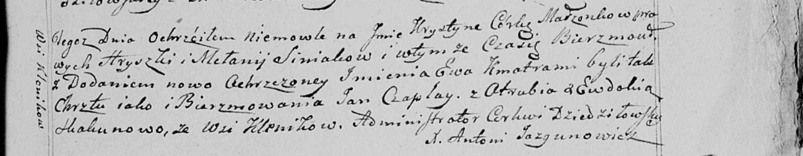

**Синяк Крыстына Грышкова (Siniakowna Krystyna)**

20 августа 1799 г -- крещение (НИАБ 136-13-894, лист 39об, №34/1799-р
(ориг)), (РГИА 823-2-18, лист 271, №33/1799-р (коп), НИАБ 136-13-938,
лист 243, №32/1799-р (коп)).

**НИАБ 136-13-894:** Лист 39об. **Метрическая запись №34/1799-р
(ориг).**

{width="6.496527777777778in"
height="0.9963713910761155in"}

Дедиловичская Покровская церковь. 20 августа 1799 года. Метрическая
запись о крещении.

Siniakowna Krystyna -- дочь родителей с деревни Клинники.

Siniak Hryszka -- отец.

Siniakowa Mełanija -- мать.

Czaplay Jan -- кум.

Skakunowa Ewdokija -- кума.

Jazgunowicz Antoni -- ксёндз.

**РГИА 823-2-18:** Лист 271. **Метрическая запись №33/1799-р (коп).**

{width="6.496527777777778in"
height="2.2881944444444446in"}

Дедиловичская Покровская церковь. 20 августа 1799 года. Метрическая
запись о крещении.

Siniakowna Krystyna -- дочь.

Siniak Hryszka -- отец.

Siniakowa Mełania -- мать.

Czaplay Jan -- кум.

Huzniakowa Natalla \[Skakunowa Ewdokija\] -- кума.

Jazgunowicz Antoni -- ксёндз.

**НИАБ 136-13-938:** Лист 243. **Метрическая запись №32/1799-р (коп).**

(См. тж. НИАБ 136-13-894, лист 39об, №34/1799-р (ориг); РГИА 823-2-18,
лист 271, №33/1799-р (коп))

{width="6.496527777777778in"
height="1.2708333333333333in"}

Дедиловичская Покровская церковь. 20 августа 1799 года. Метрическая
запись о крещении.

Siniakowna Krystyna Ewa -- дочь родителей с деревни Клинники.

Siniak Hryszka -- отец.

Siniakowa Mełanija -- мать.

Czaplay Jan -- кум, с деревни Отруб.

Skakunowa Ewdokia - кума, с деревни Клинники.

Jazgunowicz Antoni -- ксёндз.
