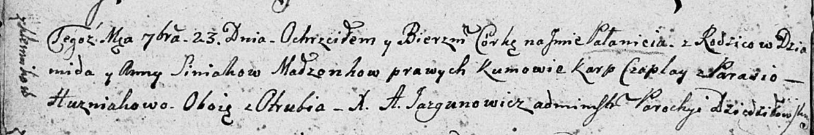

**Синяк Анна (Siniakowa Anna)**

23 сентября 1807 г -- крещение дочери Паланеи (НИАБ 136-13-894, лист
63об, №40/1807-р (ориг)).

**НИАБ 136-13-894:** Лист 63об. **Метрическая запись №40/1807-р
(ориг).**

Дедиловичская Покровская церковь. 23 сентября 1807 года. Метрическая
запись о крещении.

Siniakowna Pałanieja -- дочь родителей с деревни Клинники.

Siniak Dziamid -- отец.

Siniakowa Anna -- мать.

Czaplay Karp -- кум, с деревни Отруб.

Huzniakowa Parasia -- кума, с деревни Отруб.

Jazgunowicz Antoni -- ксёндз.
