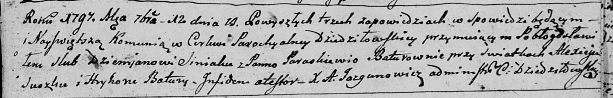
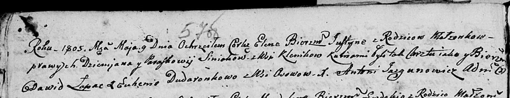
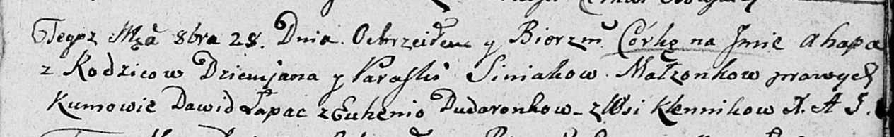
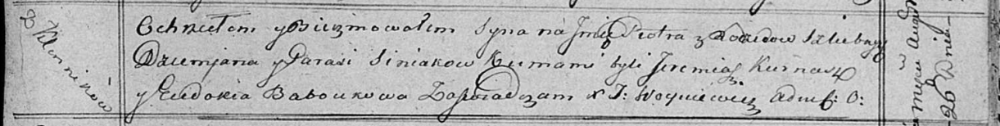

**Синяк Демьян (Siniak Dziamjan, Dziemjan)**

12 сентября 1797 г -- венчание с Параскевией Батуро (НИАБ 136-13-894,
лист 5, №13/1797-б (ориг)).

2 октября 1798 г -- крещение сына Мацея (НИАБ 136-13-894, лист 37,
№49/1798-р (ориг)), (РГИА 823-2-18, лист 266об, №50/1798-р (коп)).

9 мая 1805 г -- крещение дочери Елены Юстыны (НИАБ 136-13-894, лист
57об, №25/1805-р (ориг)).

29 октября 1807 г -- крещение дочери Агапы (НИАБ 136-13-894, лист 64,
№46/1807-р (ориг)).

26 августа 1815 г -- крещение сына Петра (НИАБ 136-13-894, лист 93,
№37/1815-р (ориг)).

**НИАБ 136-13-920:** Лист 5. **Метрическая запись №13/1797-б (ориг).**

Дедиловичская Покровская церковь. 12 сентября 1797 года. Метрическая
запись о венчании.

Siniak Dziemjan -- жених с деревни \[Клинники\].

Baturowna Paraskiewija -- невеста.

Suszko Aliexiej -- свидетель.

Batura Hryhor -- свидетель.

Jazgunowicz Antoni -- ксёндз.

**НИАБ 136-13-894:** Лист 37. **Метрическая запись №49/1798-р (ориг).**

Дедиловичская Покровская церковь. 2 октября 1798 года. Метрическая
запись о крещении.

Siniak Maciey -- сын родителей с деревни Клинники.

Siniak Dziamjan -- отец.

Siniakowa Paraskiewia -- мать.

Łapać Dawid - кум.

Suszkowa Euhenija - кума.

Jazgunowicz Antoni -- ксёндз.

**РГИА 823-2-18:** Лист 266об. **Метрическая запись №50/1798-р (коп).**

Дедиловичская Покровская церковь. 2 октября 1798 года. Метрическая
запись о крещении.

Sieniak Maciey -- сын родителей с деревни Клинники.

Sieniak Dziemian -- отец.

Sieniakowa Paraskiewia -- мать.

Łapac Dawid -- кум.

Suszkowa Euhenia -- кума.

Jazgunowicz Antoni -- ксёндз.

**НИАБ 136-13-894:** Лист 57об. **Метрическая запись №25/1805-р
(ориг).**

Дедиловичская Покровская церковь. 9 мая 1805 года. Метрическая запись о
крещении.

Siniakowna Elena Justyna -- дочь родителей с деревни Клинники.

Siniak Dziemjan -- отец.

Siniakowa Paraskowija -- мать.

Łapać Dawid -- кум.

Dudaronkowa Euhenija -- кума, с деревни Осовo.

Jazgunowicz Antoni -- ксёндз.

**НИАБ 136-13-894:** Лист 64. **Метрическая запись №46/1807-р (ориг).**

Дедиловичская Покровская церковь. 29 октября 1807 года. Метрическая
запись о крещении.

Siniakowna Ahapa -- дочь родителей с деревни Клинники.

Siniak Dziemian -- отец.

Siniakowa Paraska -- мать.

Łapać Dawid -- кум.

Dudaronkowa Eugenija -- кума.

Jazgunowicz Antoni -- ксёндз

**НИАБ 136-13-894:** Лист 93. **Метрическая запись №37/1815-р (ориг).**

Осовская Покровская церковь. 26 августа 1815 года. Метрическая запись о
крещении.

Siniak Piotr -- сын родителей с деревни Клинники.

Siniak Dziemjan -- отец.

Siniakowa Parasia -- мать.

Kurnasz Jeremiasz -- кум.

Baboukowa Eudokia -- кума.

Woyniewicz Tomasz -- ксёндз.
