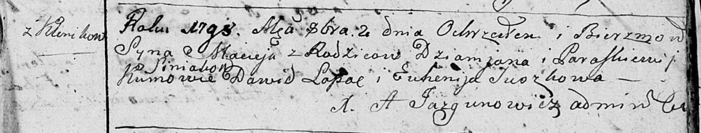

**Синяк Мацей Демьянов (Siniak Maciey)**

2 октября 1798 г -- крещение сына Мацея (НИАБ 136-13-894, лист 37,
№49/1798-р (ориг)), (РГИА 823-2-18, лист 266об, №50/1798-р (коп)).

**НИАБ 136-13-894:** Лист 37. **Метрическая запись №49/1798-р (ориг).**

Дедиловичская Покровская церковь. 2 октября 1798 года. Метрическая
запись о крещении.

Siniak Maciey -- сын родителей с деревни Клинники.

Siniak Dziamjan -- отец.

Siniakowa Paraskiewia -- мать.

Łapać Dawid - кум.

Suszkowa Euhenija - кума.

Jazgunowicz Antoni -- ксёндз.

**РГИА 823-2-18:** Лист 266об. **Метрическая запись №50/1798-р (коп).**

Дедиловичская Покровская церковь. 2 октября 1798 года. Метрическая
запись о крещении.

Sieniak Maciey -- сын родителей с деревни Клинники.

Sieniak Dziemian -- отец.

Sieniakowa Paraskiewia -- мать.

Łapac Dawid -- кум.

Suszkowa Euhenia -- кума.

Jazgunowicz Antoni -- ксёндз.
