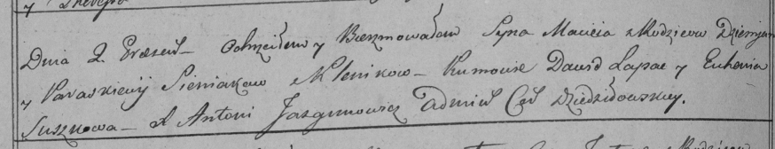

**Синяк Пётр Демьянов (Siniak Piotr)**

26 августа 1815 г -- крещение сына Петра (НИАБ 136-13-894, лист 93,
№37/1815-р (ориг)).

**НИАБ 136-13-894:** Лист 93. **Метрическая запись №37/1815-р (ориг).**

{width="6.496527777777778in"
height="0.8193580489938758in"}

Осовская Покровская церковь. 26 августа 1815 года. Метрическая запись о
крещении.

Siniak Piotr -- сын родителей с деревни Клинники.

Siniak Dziemjan -- отец.

Siniakowa Parasia -- мать.

Kurnasz Jeremiasz -- кум.

Baboukowa Eudokia -- кума.

Woyniewicz Tomasz -- ксёндз.
