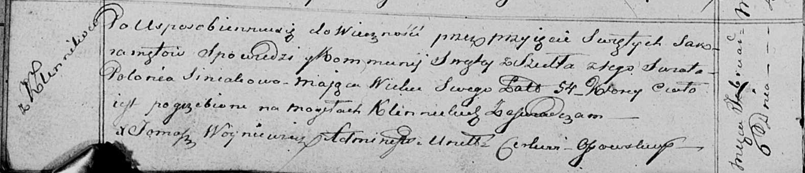

**Синяк Полония (Siniakowa Połonia)**

6 февраля 1816 г -- отпевание, умерла в возрасте 54 лет (родилась около
1762 г) (НИАБ 136-13-919, лист 29об, №2/1816-у (ориг))

**НИАБ 136-13-919:** Лист 29об. **Метрическая запись №2/1816-у (ориг).**

{width="6.496527777777778in"
height="1.3993055555555556in"}

Осовская униатская церковь. 6 февраля 1816 года. Метрическая запись об
отпевании.

Siniakowa Połonia -- умершая, 54 года, с деревни Клинники, похоронена на
кладбище деревни Клинники.

Woyniewicz Tomasz -- ксёндз.
