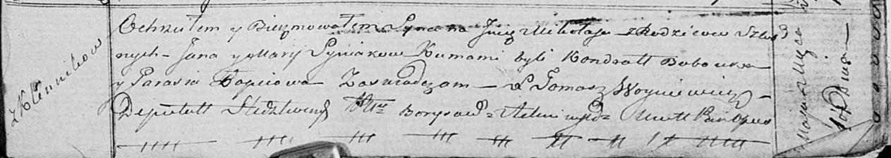

**Синяк Миколай Янов (Siniak Mikołay)**

1 мая 1818 г -- крещение (НИАБ 136-13-894, лист 98, №14/1818-р (ориг)).

**НИАБ 136-13-894:** Лист 98. **Метрическая запись №14/1818-р (ориг).**

Осовская Покровская церковь. 1 мая 1818 года. Метрическая запись о
крещении.

Syniak Mikołay -- сын родителей с деревни Клинники.

Syniak Jan -- отец.

Syniakowa Marija -- мать.

Bobouka Kondrat -- кум.

Łapciowa Parasia -- кума.

Woyniewicz Tomasz -- ксёндз.
