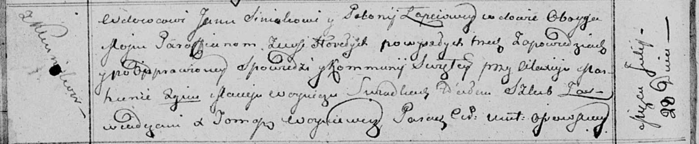
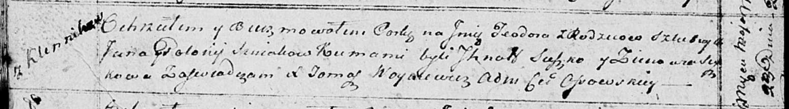

**Синяк Ян (Siniak Jan)**

28 июля 1813 г -- венчание с вдовой Полонией Лапец с деревни Горелое
(НИАБ 136-13-920, лист 19об, №12/1813-б (ориг)).

23 мая 1815 г -- крещение дочери Тодоры (НИАБ 136-13-894, лист 92об,
№27/1815-р (ориг)).

**НИАБ 136-13-920:** Лист 19об. **Метрическая запись №12/1813-б
(ориг).**

Осовская Покровская церковь. 28 июля 1813 года. Запись о венчании.

Siniak Jan -- жених, вдовец, парафии Осовской, с деревни Клинники.

Łapciowa Połonija -- невеста, вдова, парафии Осовской, с деревни
Горелое.

Marhun Alaxiej -- свидетель.

Woynicz Maciey -- свидетель.

Woyniewicz Tomasz -- ксёндз.

**НИАБ 136-13-894:** Лист 92об. **Метрическая запись №27/1815-р
(ориг).**

Осовская Покровская церковь. 23 мая 1815 года. Метрическая запись о
крещении.

Siniakowna Teodora -- дочь родителей с деревни Клинники.

Siniak Jan -- отец.

Siniakowa Połonija -- мать.

Suszko Jhnat -- кум.

Suszkowa Zinowia -- кума.

Woyniewicz Tomasz -- ксёндз.
