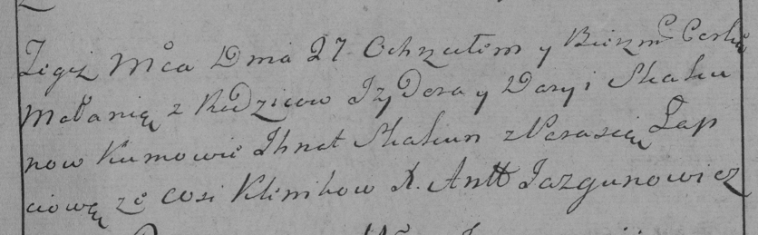

**Скакун Дарыя (Skakunowa Darya)**

27 декабря 1784 г -- крещение дочери Малании (РГИА 823-2-18, лист 228,
№28/1784-р (коп)).

**РГИА 823-2-18:** Лист 228. **Метрическая запись №28/1784-р (коп).**

{width="6.496527777777778in"
height="2.0125in"}

Дедиловичская Покровская церковь. 27 декабря 1784 года. Метрическая
запись о крещении.

Skakunowna Małania -- дочь родителей с деревни Клинники.

Skakun Jzydor -- отец.

Skakunowa Darya -- мать.

Skakun Jhnat -- кум.

Łapciowa Parasia - кума.

Jazgunowicz Antoni -- ксёндз.
