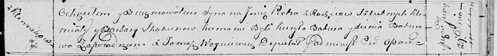

**Скакун Клемята (Skakun Klemiata)**

29 июня 1814 г -- крещение сына Петра (НИАБ 136-13-894, лист 90,
№41/1814-р (ориг)).

**НИАБ 136-13-894:** Лист 90. **Метрическая запись №41/1814-р (ориг).**

Осовская Покровская церковь. 29 июня 1814 года. Метрическая запись о
крещении.

Skakun Piotr -- сын родителей с деревни Клинники.

Skakun Klemiata -- отец.

Skakunowa Barbara -- мать.

Baturo Kuryło -- кум.

Baturowa Xienia -- кума.

Woyniewicz Tomasz -- ксёндз.
