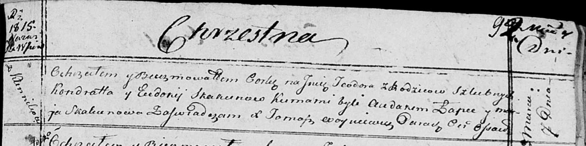

**Скакун Тодора Кондратова (Skakunowna Teodora)**

7 марта 1815 г -- крещение (НИАБ 136-13-894, лист 92, №10/1815-р
(ориг)).

**НИАБ 136-13-894:** Лист 92. **Метрическая запись №10/1815-р (ориг).**

{width="6.496527777777778in"
height="1.6266458880139982in"}

Осовская Покровская церковь. 7 марта 1815 года. Метрическая запись о
крещении.

Skakunowna Teodora -- дочь родителей с деревни Клинники.

Skakun Kondrat -- отец.

Skakunowa Eudokija -- мать.

Łapieć Audakim -- кум.

Skakunowa Marja -- кума.

Woyniewicz Tomasz -- ксёндз.
