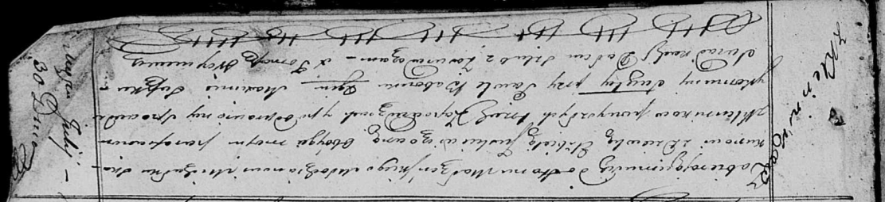

**Скакун Михалка (Skakun Michałka)**

30 июля 1821 г -- венчание с девкой Елисаветой Юшкевич с деревни
Клинники (НИАБ 136-13-920, лист 28, №6/1821-б (ориг)).

**НИАБ 136-13-920:** Лист 28. **Метрическая запись №6/1821-б (ориг).**

{width="6.496527777777778in"
height="1.4912040682414698in"}

Осовская Покровская церковь. 30 июля 1821 года. Запись о венчании.

Skakun Michałka -- жених, молодой, парафии Осовской, с деревни Клинники.

Juszkiewiczowna Elżbieta -- невеста, девка, парафии Осовской, с деревни
Клинники.

Babowka Paweł -- свидетель.

Suszko Maxim -- свидетель.

Woyniewicz Tomasz -- ксёндз.
