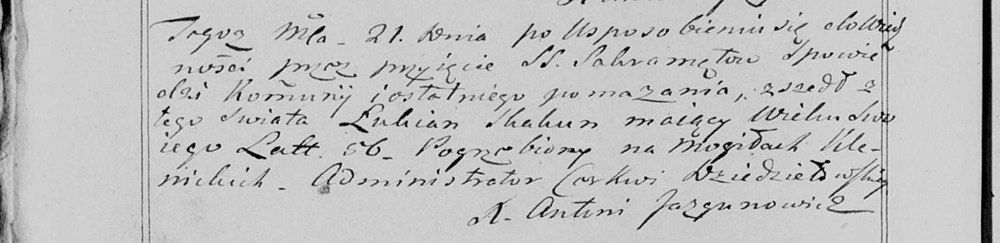

**Скакун Лукьян (Skakun Łukjan)**

21 марта 1799 г -- отпевание, умер в возрасте 56 лет (родился около 1743
г) (НИАБ 136-13-938, лист 250об, №7/1799-у (коп)).

**НИАБ 136-13-938:** Лист 250об. **Метрическая запись №7/1799-у (коп).**

(См. тж. НИАБ 136-13-919, Лист 8об. Метрическая запись №7/1799-у (ориг))

Дедиловичская Покровская церковь. 21 марта 1799 года. Метрическая запись
об отпевании.

Skakun Łukjan -- умерший, 56 лет, с деревни \[Клинники\], похоронен на
кладбище деревни Клинники.

Jazgunowicz Antoni -- ксёндз.
